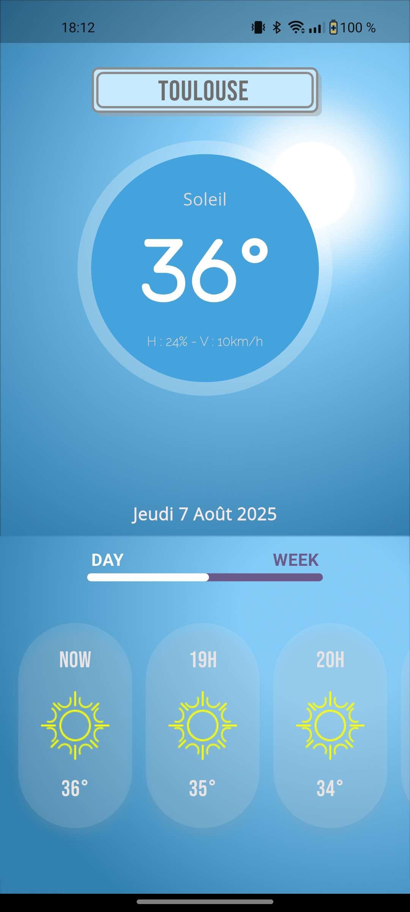
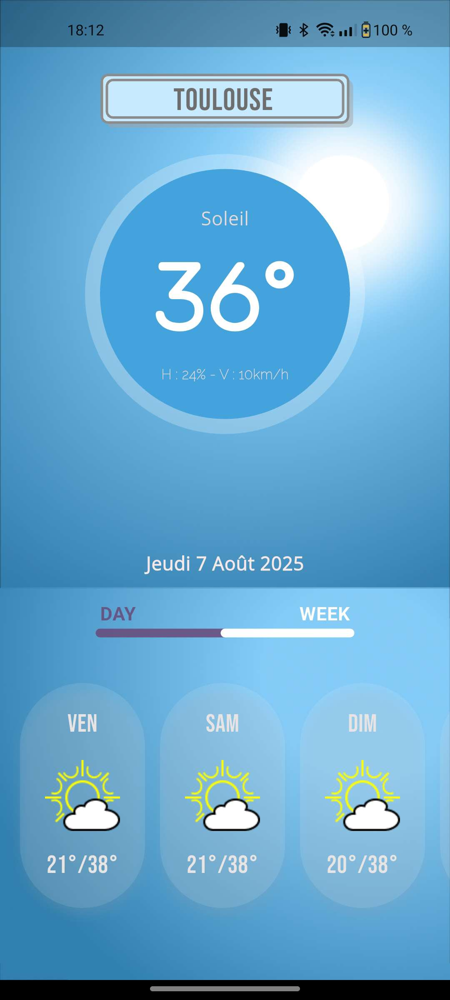
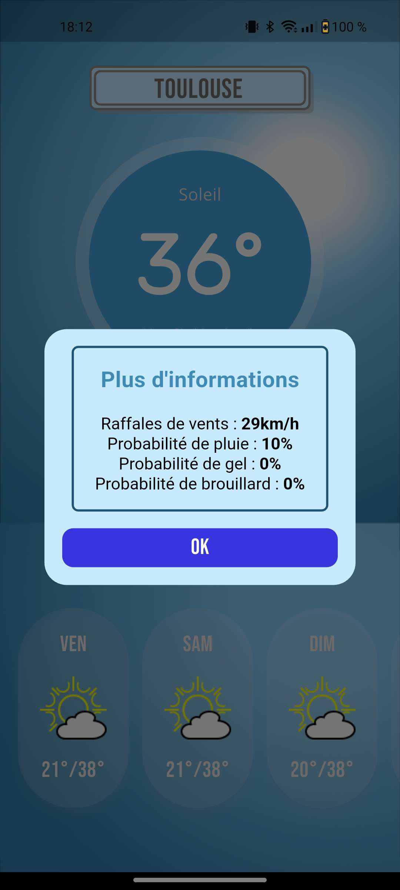
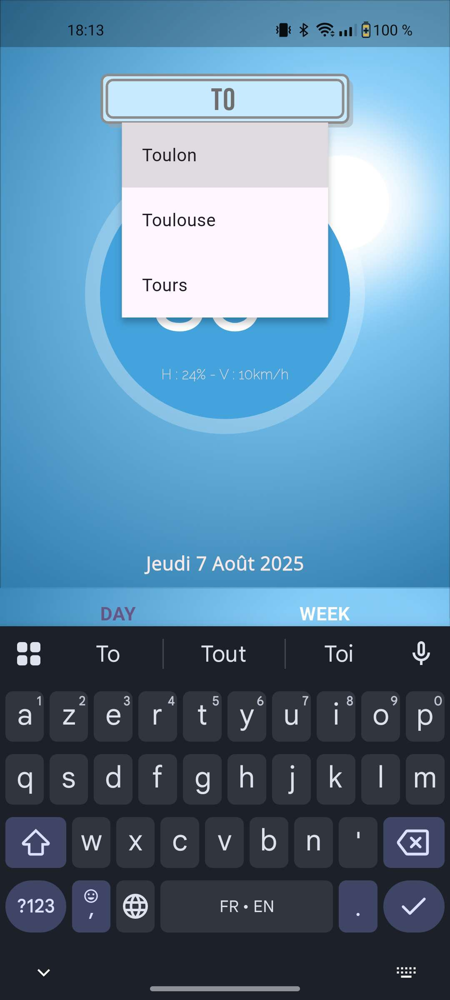

# Richard

**Richard** est une application Flutter multiplateforme (Android/iOS) conçue pour offrir diverses fonctionnalités utiles aux membres de ma famille.

## 🛠️ Fonctionnalités

- [X] Application météo intégrée utilisant l’[API Météo Concept](https://api.meteo-concept.com/documentation)
- [ ] Outil de rappel avec notifications pour ne rien oublier
- [ ] Mini-jeu intégré pour se divertir

## 📱 Captures d’écran

<p align="center">
  
  
  
  
  
</p>

## 🚀 Lancement rapide

```bash
git clone https://github.com/IAidenI/Richard.git
cd ton-projet
flutter pub get
flutter run
```

### Prérequis

- [Flutter SDK](https://flutter.dev/docs/get-started/install)
- Dart >= 3.0.0
- Android Studio / VS Code / autre éditeur

### Installation

```bash
git clone https://github.com/IAidenI/Richard.git
cd ton-projet
flutter pub get
flutter run
```
